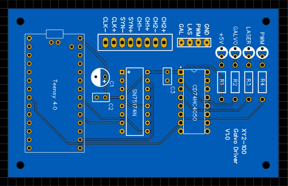
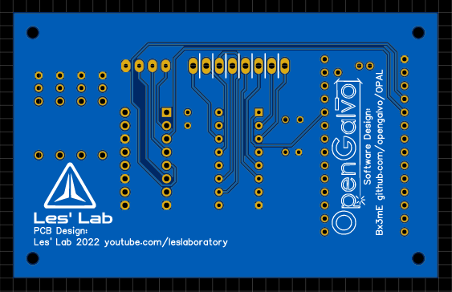
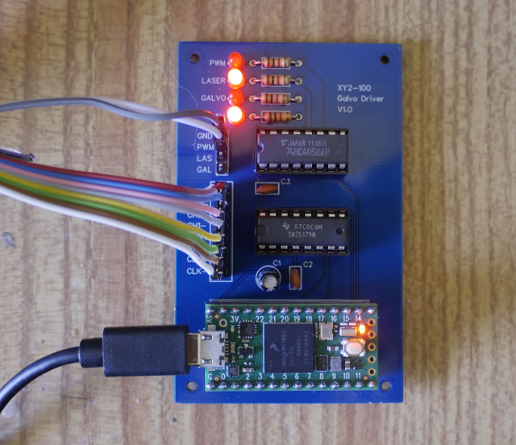

# OPAL_PCB
PCB design for OpenGalvo OPAL

These are the PCB files and schematic for this awesome project: https://github.com/opengalvo/OPAL/
I have sucessfully used this to drive a Domino D100+ Coder Head
(Video will be posted soon)

As discussed in the original design, an SN75174 Line Driver is used to drive the Galvo head.
Additionally a CD74HC4050 is used to buffer and raise the logic levels for the Galvo SSR, Laser SSR and Laser PWM signals from 3v3 to 5V.

PCB Top Side:

PCB Back Side:

Populated PCB:

